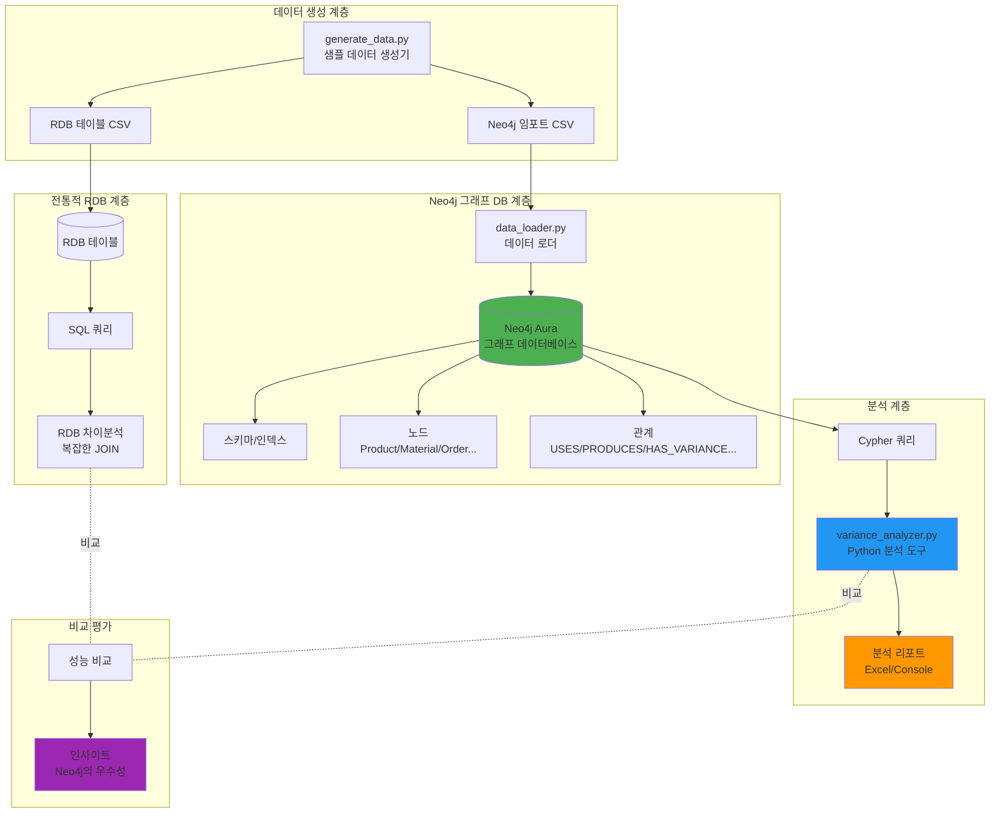
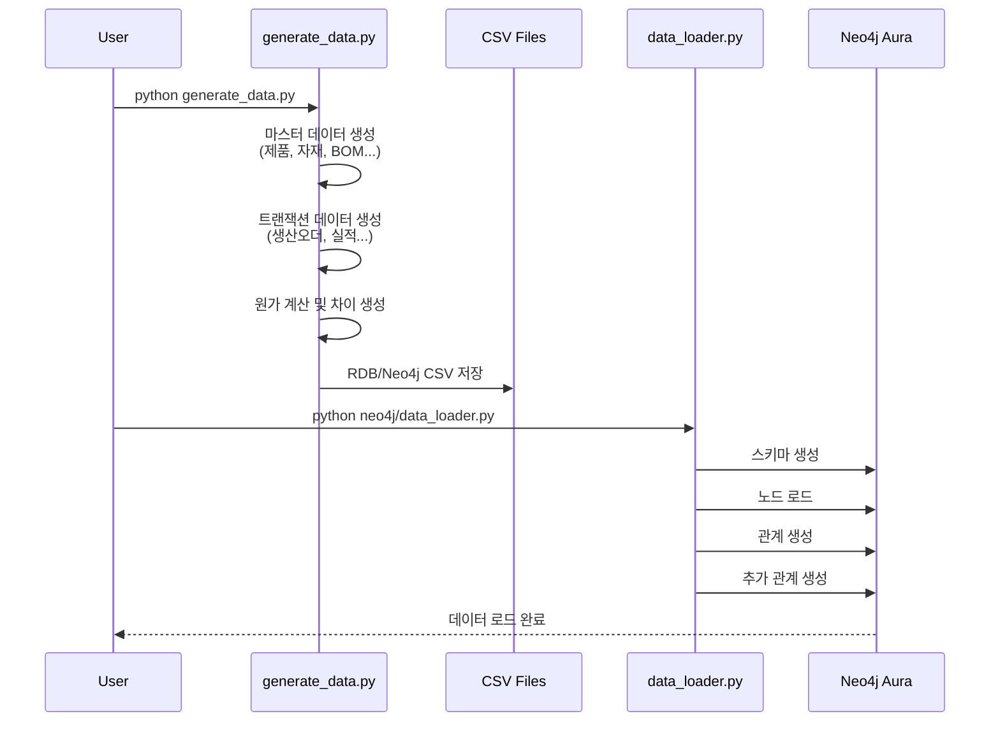
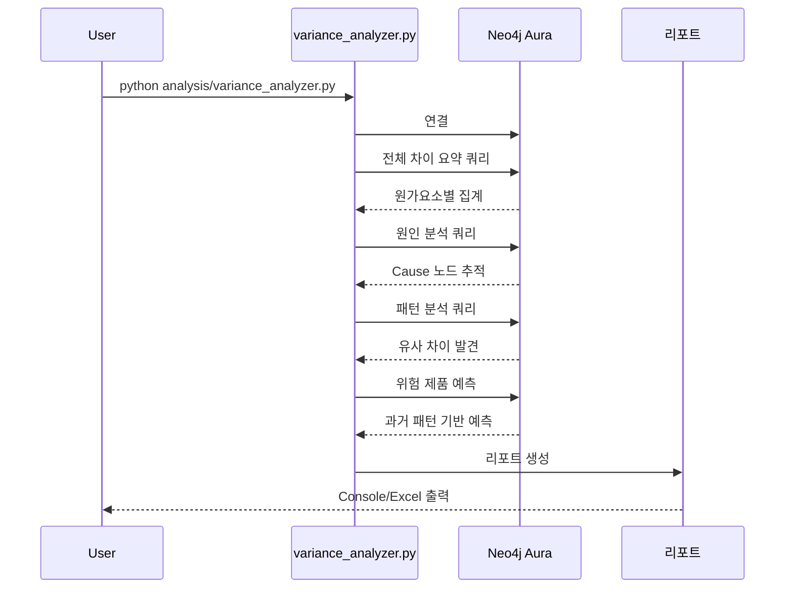

# 시스템 아키텍처

## 개요

본 시스템은 반도체 패키징 공정의 원가차이 분석을 위한 그래프 데이터베이스 기반 솔루션입니다.
전통적인 RDB 시스템의 한계를 극복하고, Neo4j를 활용하여 빠르고 직관적인 차이 원인 추적을 구현합니다.

## 시스템 구성도



## 데이터 흐름

### 1. 데이터 생성 및 로드



### 2. 차이분석 흐름



## 계층별 상세 설명

### 1. 데이터 모델 계층

#### RDB 모델
```
PRODUCT_MASTER
    ├─ BOM ─> MATERIAL_MASTER
    └─ ROUTING ─> WORK_CENTER

PRODUCTION_ORDER
    ├─ MATERIAL_CONSUMPTION
    ├─ OPERATION_ACTUAL
    ├─ COST_ACCUMULATION
    └─ VARIANCE_ANALYSIS ─> CAUSE_CODE
```

**특징**:
- 정규화된 테이블 구조
- 외래키로 참조 무결성 보장
- 복잡한 관계는 암묵적 (JOIN 필요)

#### Neo4j 그래프 모델
```
(Product)-[:USES_MATERIAL]->(Material)
(Product)<-[:PRODUCES]-(ProductionOrder)
(ProductionOrder)-[:HAS_VARIANCE]->(Variance)
(Variance)-[:CAUSED_BY]->(Cause)
(Variance)-[:RELATED_TO_MATERIAL]->(Material)
(ProductionOrder)-[:NEXT_ORDER]->(ProductionOrder)
(ProductionOrder)-[:SAME_PRODUCT]->(ProductionOrder)
```

**특징**:
- 노드와 관계로 명시적 표현
- 관계 자체가 데이터 (속성 포함)
- 다차원 관계 표현 용이

### 2. 저장 계층

#### Neo4j Aura (클라우드)
- **타입**: Managed Graph Database
- **버전**: Neo4j 5.x
- **프로토콜**: Bolt (neo4j+s://)
- **제약사항**: 
  - 무료 티어: 200K 노드+관계
  - 동시 연결: 3개
  - 미사용 30일 후 자동 삭제

#### 스키마 구성
```cypher
// 제약조건 (Unique)
- Product.id
- Material.id
- ProductionOrder.id
- Variance.id
- Cause.code

// 인덱스
- Product.type
- Material.type
- Variance.cost_element
- Variance.severity
```

### 3. 분석 계층

#### Cypher 쿼리
**위치**: `analysis/variance_queries.cypher`

**주요 쿼리 카테고리**:
1. 기본 조회 (노드/관계 확인)
2. 제품/BOM 분석
3. 생산 실적 분석
4. 원가차이 분석
5. 원인 추적 (그래프 탐색)
6. 패턴 분석 (유사성, 시계열)
7. 영향 범위 분석
8. 예측 및 시뮬레이션

**예시**:
```cypher
// 금 가격 상승의 영향 분석
MATCH (c:Cause {code: 'GOLD_PRICE_UP'})<-[:CAUSED_BY]-(v:Variance)
MATCH (v)<-[:HAS_VARIANCE]-(po:ProductionOrder)-[:PRODUCES]->(p:Product)
RETURN p.name, SUM(v.variance_amount) as total_impact
```

#### Python 분석 도구
**파일**: `analysis/variance_analyzer.py`

**주요 기능**:
- `get_variance_summary()`: 전체 요약
- `get_top_causes()`: 주요 원인 Top N
- `find_similar_variances()`: 유사 패턴 발견
- `get_risk_products()`: 위험 제품 예측
- `generate_summary_report()`: 콘솔 리포트
- `export_to_excel()`: Excel 리포트

### 4. 통합 계층

#### Python 드라이버
```python
from neo4j import GraphDatabase

driver = GraphDatabase.driver(uri, auth=(user, password))
with driver.session(database="neo4j") as session:
    result = session.run(cypher_query, parameters)
    df = pd.DataFrame([dict(r) for r in result])
```

**라이브러리**:
- `neo4j`: 공식 Python 드라이버
- `pandas`: 데이터 분석
- `openpyxl`: Excel 출력
- `python-dotenv`: 환경 변수 관리

## 핵심 설계 원칙

### 1. 온톨로지 우선 설계
- RDB 테이블을 단순 변환하지 않음
- 도메인 지식을 그래프로 표현
- 차이분석에 최적화된 관계 설계

### 2. 명시적 관계 표현
```python
# RDB: 암묵적 관계
SELECT ... FROM A JOIN B ON ... JOIN C ON ...

# Neo4j: 명시적 관계
MATCH (a)-[:REL1]->(b)-[:REL2]->(c)
```

### 3. 다차원 관계 활용
```cypher
// 시계열 관계
(Order1)-[:NEXT_ORDER]->(Order2)

// 유사성 관계
(Variance1)-[:SIMILAR_TO]->(Variance2)

// 인과 관계
(Cause)-[:AFFECTS]->(Material)-[:IMPACTS]->(Product)
```

### 4. 성능 최적화
- 제약조건으로 Unique 보장
- 인덱스로 빠른 조회
- 추가 관계로 복잡한 JOIN 회피

## 배포 아키텍처

### 개발 환경
```
로컬 머신
├─ Python 가상환경 (venv)
├─ 데이터 생성 스크립트
├─ CSV 파일 (로컬)
└─ Neo4j Aura (클라우드)
```

### 프로덕션 환경 (확장 시나리오)
```
┌─────────────────┐
│  데이터 소스    │
│  (ERP/MES)     │
└────────┬────────┘
         │
    ┌────▼─────┐
    │  ETL     │
    │  Pipeline│
    └────┬─────┘
         │
    ┌────▼────────────┐
    │  Neo4j Cluster  │
    │  (Enterprise)   │
    └────┬────────────┘
         │
    ┌────▼────────┐
    │  API Server │
    │  (FastAPI)  │
    └────┬────────┘
         │
    ┌────▼──────────┐
    │  Web Dashboard│
    │  (React)      │
    └───────────────┘
```

## 확장성 고려사항

### 데이터 볼륨
| 규모 | 노드 수 | 관계 수 | 권장 환경 |
|-----|--------|--------|----------|
| 소규모 | ~10K | ~50K | Aura Free |
| 중규모 | ~100K | ~500K | Aura Pro |
| 대규모 | ~1M+ | ~5M+ | Enterprise Cluster |

### 쿼리 최적화
1. **인덱스 활용**: 자주 검색하는 속성에 인덱스
2. **LIMIT 사용**: 결과 제한으로 응답 시간 단축
3. **프로파일링**: `PROFILE` 키워드로 실행 계획 분석
4. **배치 처리**: 대량 데이터 로드 시 트랜잭션 분할

### 보안
- **인증**: Neo4j 사용자 인증
- **암호화**: TLS 연결 (neo4j+s://)
- **환경 변수**: .env 파일로 크레덴셜 관리
- **역할 기반 접근**: Neo4j RBAC (Enterprise)

## 모니터링 및 유지보수

### 시스템 상태 확인
```cypher
// 노드 개수
MATCH (n) RETURN labels(n), COUNT(n)

// 관계 개수
MATCH ()-[r]->() RETURN type(r), COUNT(r)

// 데이터베이스 크기
CALL dbms.queryJmx("org.neo4j:instance=kernel#0,name=Store sizes")
```

### 성능 모니터링
```cypher
// 느린 쿼리 확인
CALL dbms.listQueries()

// 캐시 상태
CALL dbms.queryJmx("org.neo4j:instance=kernel#0,name=Page cache")
```

### 백업 및 복구
- **Aura**: 자동 백업 (Pro 이상)
- **On-premise**: `neo4j-admin backup`
- **Export**: APOC 라이브러리로 CSV 추출

## 다음 단계

1. **실시간 데이터 연동**: ERP/MES 시스템과 ETL 파이프라인 구축
2. **머신러닝 통합**: 차이 예측 모델 개발
3. **대시보드 개발**: React + Neo4j Bloom
4. **알림 시스템**: 임계값 초과 시 자동 알림
5. **그래프 알고리즘**: PageRank로 핵심 원인 식별

---

**참고 문서**:
- [Neo4j 공식 문서](https://neo4j.com/docs/)
- [Cypher 쿼리 가이드](https://neo4j.com/docs/cypher-manual/)
- [Graph Data Science](https://neo4j.com/docs/graph-data-science/)
