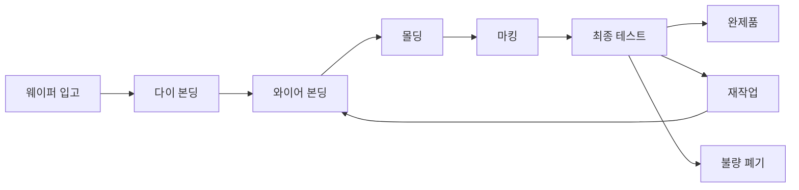

# 반도체 패키징 공정 시나리오 설계

## 1. 시나리오 개요

### 비즈니스 컨텍스트

반도체 제조의 마지막 단계인 **패키징 공정**은 웨이퍼에서 절단된 실리콘 칩을 보호하고 외부 회로와 연결할 수 있도록 조립하는 과정입니다. 이 공정은 일반 제조업과 유사하여 이해하기 쉽고, 재료비, 노무비, 경비가 명확하게 구분되어 원가차이 분석에 적합합니다.

### 대상 제품

우리는 다양한 패키지 타입의 반도체 제품을 생산합니다:

1. **QFP (Quad Flat Package)**: 표준 플랫 패키지
2. **BGA (Ball Grid Array)**: 고밀도 패키지
3. **SOP (Small Outline Package)**: 소형 패키지
4. **TSOP (Thin Small Outline Package)**: 박형 패키지
5. **PLCC (Plastic Leaded Chip Carrier)**: 플라스틱 패키지

## 2. 패키징 공정 상세

### 2.1 공정 흐름도

### 2.2 각 공정 설명

#### A. 다이 본딩 (Die Bonding)
**목적**: 실리콘 칩(다이)을 리드프레임 또는 기판에 부착

**주요 활동**:
- 웨이퍼에서 개별 다이 픽업
- 접착제(다이 어태치 필름 또는 에폭시) 도포
- 기판에 정밀 배치
- 열경화 또는 UV 경화

**원가 요소**:
- 재료비: 다이(칩), 기판, 접착제
- 노무비: 장비 운영자
- 경비: 다이 본딩 장비 감가상각, 전력비

**표준 작업시간**: 제품당 15초 (시간당 240개)

#### B. 와이어 본딩 (Wire Bonding)
**목적**: 금선으로 칩의 패드와 기판의 리드를 전기적으로 연결

**주요 활동**:
- 초미세 금선(25μm) 사용
- 초음파 본딩으로 연결
- 일반적으로 칩당 20-100개 와이어

**원가 요소**:
- 재료비: 금선 (가격 변동성 큼)
- 노무비: 숙련 작업자
- 경비: 와이어 본더 장비 감가상각

**표준 작업시간**: 제품당 30초 (시간당 120개)

**주요 불량**:
- 와이어 끊김
- 본딩 불량
- 루프 높이 불량

#### C. 몰딩 (Molding)
**목적**: 에폭시 수지로 칩과 와이어를 보호

**주요 활동**:
- 에폭시 수지를 금형에 주입
- 고온 고압으로 성형 (175°C, 80bar)
- 냉각 및 금형 탈형

**원가 요소**:
- 재료비: 에폭시 수지 (molding compound)
- 노무비: 장비 운영자
- 경비: 몰딩 프레스 감가상각, 금형 유지보수, 전력비

**표준 작업시간**: 제품당 20초 (시간당 180개)

#### D. 마킹 (Marking)
**목적**: 제품 정보(모델명, 날짜 코드, 로트번호) 인쇄

**주요 활동**:
- 레이저 마킹 또는 잉크 인쇄
- 자동 검사

**원가 요소**:
- 재료비: 잉크 (레이저는 소모재 없음)
- 노무비: 장비 운영자
- 경비: 마킹 장비 감가상각

**표준 작업시간**: 제품당 5초 (시간당 720개)

#### E. 최종 테스트 (Final Test)
**목적**: 전기적 특성 및 외관 검사

**주요 활동**:
- 전기적 기능 테스트
- 외관 검사 (AOI)
- 치수 검사
- 분류 및 패키징

**원가 요소**:
- 재료비: 테스트 소켓, 포장재
- 노무비: 검사원
- 경비: 테스트 장비 감가상각

**표준 작업시간**: 제품당 10초 (시간당 360개)

**불량 처리**:
- 경미한 불량: 재작업 (와이어 본딩으로 회귀)
- 심각한 불량: 폐기

## 3. 원가 구조

### 3.1 원가 요소 분류

#### 직접재료비 (Direct Material)
1. **다이 (Die/Chip)**: 원가의 40-50%
   - 웨이퍼 제조원가를 다이 개수로 배분
   - 웨이퍼 크기: 300mm
   - 다이당 원가: 제품별 상이 (5,000원 ~ 50,000원)

2. **기판/리드프레임**: 원가의 15-20%
   - QFP: 100원/개
   - BGA: 500원/개
   - SOP: 80원/개

3. **금선 (Gold Wire)**: 원가의 10-15%
   - 금 시장가격에 연동 (변동성 큼)
   - 제품당 사용량: 5-20mg
   - 표준단가: 60원/mg

4. **에폭시 수지 (Molding Compound)**: 원가의 5-8%
   - 제품당 사용량: 0.5-2g
   - 표준단가: 100원/g

5. **기타 자재**: 원가의 2-3%
   - 접착제, 잉크, 포장재

#### 직접노무비 (Direct Labor)
- 작업자 시간당 인건비: 30,000원
- 제품별 표준 작업시간 합계: 80초 (1.33분)
- 제품당 노무비: 약 667원

#### 제조간접비 (Manufacturing Overhead)
1. **변동경비**:
   - 전력비: 시간당 10,000원
   - 유지보수비: 시간당 5,000원

2. **고정경비**:
   - 장비 감가상각비: 시간당 50,000원
   - 건물 감가상각비: 시간당 10,000원
   - 간접인건비: 시간당 20,000원

- 시간당 경비 합계: 95,000원
- 제품당 경비 (시간당 240개 기준): 약 396원

### 3.2 제품별 표준원가 예시

**제품: QFP-64 (64핀 QFP 패키지)**

| 원가요소 | 세부항목 | 수량 | 단가 | 금액 |
|---------|---------|------|------|------|
| **재료비** | 다이 | 1 | 10,000 | 10,000 |
| | 리드프레임 | 1 | 100 | 100 |
| | 금선 | 10mg | 60 | 600 |
| | 에폭시 수지 | 1g | 100 | 100 |
| | 기타 자재 | - | - | 50 |
| **재료비 소계** | | | | **10,850** |
| **노무비** | 작업시간 | 1.33분 | 450 | 667 |
| **경비** | 장비/설비 | 1.33분 | 4,275 | 396 |
| **총 표준원가** | | | | **11,913** |

## 4. 원가차이 발생 시나리오

### 4.1 재료비 차이

#### 시나리오 1: 금 가격 급등
- **상황**: 국제 금 시세 20% 상승
- **영향**: 금선 단가 60원/mg → 72원/mg
- **차이 유형**: 가격 차이 (Price Variance)
- **차이 금액**: 제품당 120원 증가

#### 시나리오 2: 에폭시 과다 사용
- **상황**: 몰딩 공정에서 수지 주입량 조절 실패
- **영향**: 표준 1g → 실적 1.2g
- **차이 유형**: 수량 차이 (Quantity Variance)
- **차이 금액**: 제품당 20원 증가

#### 시나리오 3: 다이 불량률 증가
- **상황**: 웨이퍼 공정 불량으로 양품 다이 감소
- **영향**: 웨이퍼당 양품 500개 → 450개
- **차이 유형**: 수율 차이 (Yield Variance)
- **차이 금액**: 다이 단가 10% 증가

### 4.2 노무비 차이

#### 시나리오 4: 작업 효율 저하
- **상황**: 신규 작업자 투입으로 숙련도 부족
- **영향**: 표준 1.33분 → 실적 1.8분
- **차이 유형**: 효율 차이 (Efficiency Variance)
- **차이 금액**: 제품당 235원 증가

#### 시나리오 5: 임금 인상
- **상황**: 최저임금 인상 반영
- **영향**: 시간당 30,000원 → 33,000원
- **차이 유형**: 임률 차이 (Rate Variance)
- **차이 금액**: 제품당 67원 증가

### 4.3 경비 차이

#### 시나리오 6: 전력비 급등
- **상황**: 여름철 전기요금 누진제 적용
- **영향**: 시간당 전력비 10,000원 → 15,000원
- **차이 유형**: 변동경비 차이
- **차이 금액**: 제품당 21원 증가

#### 시나리오 7: 설비 가동률 저하
- **상황**: 수주 감소로 생산량 50% 감소
- **영향**: 고정비 배부율 증가 (시간당 120개 생산)
- **차이 유형**: 조업도 차이 (Volume Variance)
- **차이 금액**: 제품당 고정비 2배 증가

### 4.4 수율 차이

#### 시나리오 8: 와이어 본딩 불량 증가
- **상황**: 장비 노후화로 본딩 불량률 증가
- **영향**: 수율 98% → 95%
- **차이 유형**: 수율 차이 (Yield Loss)
- **차이 금액**: 투입 원가 3.2% 증가

## 5. 생산 계획 시나리오

### 5.1 3개월 생산 계획

**기간**: 2024년 1월 ~ 3월

**제품 믹스**:
- QFP 계열: 50%
- BGA 계열: 30%
- SOP/TSOP 계열: 20%

**월별 생산 계획**:
- 1월: 신년 수요 증가 → 높은 가동률
- 2월: 설 연휴 → 낮은 가동률
- 3월: 신제품 출시 준비 → 평균 가동률

### 5.2 차이 발생 패턴

**1월**: 
- 높은 가동률 → 조업도 차이 유리
- 수주 급증으로 잔업 발생 → 노무비 차이 불리

**2월**:
- 낮은 가동률 → 조업도 차이 불리
- 연휴로 신규 작업자 투입 → 효율 차이 불리

**3월**:
- 신제품 양산 시작 → 학습곡선 효과로 효율 차이 불리
- 구제품 재고 소진 → 구형 자재 사용으로 재료비 차이 유리

## 6. 차이분석 목표

### 6.1 분석 시나리오

우리의 Neo4j 기반 원가차이 분석 시스템은 다음을 가능하게 합니다:

1. **빠른 근본 원인 추적**
   - 특정 제품의 원가 차이가 어떤 자재/공정에서 발생했는지 즉시 파악
   - 전통적 RDB의 복잡한 JOIN 없이 그래프 탐색으로 해결

2. **유사 패턴 발견**
   - 동일한 차이가 발생한 다른 제품/오더 자동 탐지
   - 공통 원인 분석 (예: 특정 공급업체, 특정 작업장)

3. **차이 전파 분석**
   - 하나의 원인이 여러 제품에 미치는 영향 시각화
   - 예: 금 가격 상승 → 모든 와이어 본딩 제품에 영향

4. **예측 및 시뮬레이션**
   - 과거 패턴을 학습하여 미래 차이 예측
   - 가격 변동 시나리오별 영향 분석

### 6.2 핵심 성과 지표 (KPI)

- **차이분석 소요시간**: RDB 5분 → Neo4j 5초
- **근본원인 발견율**: 70% → 95%
- **차이 예측 정확도**: 80% 이상
- **시스템 응답속도**: 1초 이내

## 다음 단계

이 시나리오를 바탕으로:
1. RDB 테이블 설계 및 SQL 작성
2. Neo4j 온톨로지 설계
3. 샘플 데이터 생성
4. 차이분석 쿼리 구현

진행합니다.
