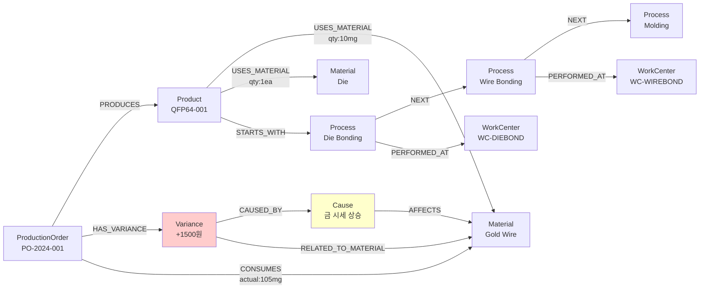

# Neo4j 온톨로지 설계 가이드

## 온톨로지란?

온톨로지(Ontology)는 특정 도메인의 개념, 개념 간의 관계, 그리고 제약 조건을 명시적으로 정의한 것입니다.
그래프 데이터베이스에서는 **노드(Node)**와 **관계(Edge/Relationship)**로 온톨로지를 표현합니다.

## 설계 원칙

### 1. RDB와의 차이점

| 측면 | RDB | Neo4j 그래프 DB |
|-----|-----|----------------|
| 데이터 모델 | 테이블 + 외래키 | 노드 + 관계 |
| 관계 표현 | JOIN (암묵적) | Edge (명시적) |
| 탐색 방식 | 테이블 스캔 + 조인 | 포인터 따라가기 |
| 복잡도 | JOIN 수에 비례 증가 | 거의 일정 (O(1)) |
| 적합한 쿼리 | 집계, 통계 | 경로 탐색, 패턴 매칭 |

### 2. 온톨로지 설계 시 고려사항

**노드(Node)로 표현할 것**:
- 독립적으로 존재하는 엔티티
- 고유한 식별자가 있는 것
- 다른 노드와 여러 관계를 맺는 것

**관계(Edge)로 표현할 것**:
- 노드 간의 연결
- 방향성이 있는 관계
- 속성을 가질 수 있음 (가중치, 수량 등)

**속성(Property)으로 표현할 것**:
- 노드나 관계의 특성
- 검색/필터링에 사용
- 계산에 필요한 값

## 설계 프로세스

### Step 1: 핵심 엔티티 노드 정의

RDB의 테이블을 기반으로 하되, 온톨로지 관점에서 재구성합니다.

#### 1.1 제안 노드 목록

| 노드 레이블 | 설명 | RDB 대응 | 비고 |
|-----------|------|---------|------|
| **Product** | 제품 | PRODUCT_MASTER | 핵심 노드 |
| **Material** | 자재 | MATERIAL_MASTER | 핵심 노드 |
| **ProductionOrder** | 생산오더 | PRODUCTION_ORDER | 트랜잭션 노드 |
| **WorkCenter** | 작업장 | WORK_CENTER | 공정 노드 |
| **Process** | 공정 단계 | ROUTING의 각 row | 신규 노드 |
| **CostElement** | 원가요소 | COST_ACCUMULATION | 집계 노드 |
| **Variance** | 원가차이 | VARIANCE_ANALYSIS | 분석 노드 |
| **Cause** | 차이 원인 | CAUSE_CODE | 원인 노드 |
| **Supplier** | 공급업체 | - | 신규 (확장) |
| **Period** | 기간 | - | 신규 (시계열) |

#### 1.2 노드 설계 결정 사항

**질문 1**: Process를 별도 노드로 만들 것인가, 아니면 관계의 속성으로 표현할 것인가?

**옵션 A**: Process를 노드로
```
(Product)-[:STEP_1]->(Process:DieBonding)-[:USES]->(WorkCenter)
(Process)-[:NEXT]->(Process:WireBonding)
```
**장점**: 공정 간 순서 관계 명시적, 공정별 분석 용이
**단점**: 노드 수 증가

**옵션 B**: Process를 관계 속성으로
```
(Product)-[:GOES_THROUGH {step: 1, process: "DIE_BONDING"}]->(WorkCenter)
```
**장점**: 단순한 구조
**단점**: 공정 자체에 대한 분석 제한

**💡 권장**: **옵션 A** - 공정을 독립 노드로 생성
- 이유: 공정별 차이분석, 공정 간 관계 추적이 중요

**질문 2**: CostElement를 노드로 만들 것인가?

**옵션 A**: CostElement를 노드로
```
(ProductionOrder)-[:HAS_COST]->(CostElement {type: "MATERIAL", planned: 10000, actual: 11000})
(CostElement)-[:CAUSED_BY]->(Material)
```

**옵션 B**: CostElement를 관계 속성으로
```
(ProductionOrder)-[:MATERIAL_COST {planned: 10000, actual: 11000}]->(Material)
```

**💡 권장**: **옵션 B** - 관계의 속성으로 표현
- 이유: 원가는 노드 간 관계에서 발생하는 값이므로 관계 속성이 자연스러움

### Step 2: 관계(Edge) 정의

#### 2.1 제품-자재 관계

**기본 관계**: BOM 구조
```
(Product)-[:USES_MATERIAL {quantity: 10.0, unit: "MG"}]->(Material)
```

**속성**:
- `quantity`: 소요량
- `unit`: 단위
- `valid_from`: 유효 시작일
- `valid_to`: 유효 종료일

**질문 3**: BOM을 별도 노드로 만들 것인가?

**옵션 A**: 직접 관계
```
(Product)-[:USES_MATERIAL {quantity: 10}]->(Material)
```

**옵션 B**: BOM을 중간 노드로
```
(Product)-[:HAS_BOM]->(BOM)-[:SPECIFIES]->(Material)
```

**💡 권장**: **옵션 A** - 직접 관계
- 이유: 단순하고 직관적, 대부분의 쿼리에 충분

#### 2.2 제품-공정 관계

**공정 흐름**:
```
(Product)-[:STARTS_WITH]->(Process:DieBonding)
(Process:DieBonding)-[:NEXT]->(Process:WireBonding)
(Process:WireBonding)-[:NEXT]->(Process:Molding)
...
```

**작업장 관계**:
```
(Process)-[:PERFORMED_AT]->(WorkCenter)
```

**속성**:
- `sequence`: 공정 순서
- `standard_time_sec`: 표준 작업시간

#### 2.3 생산오더 관계

**제품 생산**:
```
(ProductionOrder)-[:PRODUCES]->(Product)
```

**자재 소비**:
```
(ProductionOrder)-[:CONSUMES {planned_qty: 100, actual_qty: 105}]->(Material)
```

**작업 수행**:
```
(ProductionOrder)-[:WORKS_AT {planned_time: 60, actual_time: 75}]->(WorkCenter)
```

#### 2.4 차이 관계

**차이 발생**:
```
(ProductionOrder)-[:HAS_VARIANCE]->(Variance)
```

**원인 추적**:
```
(Variance)-[:CAUSED_BY]->(Cause)
(Variance)-[:RELATED_TO_MATERIAL]->(Material)
(Variance)-[:RELATED_TO_PROCESS]->(Process)
```

**유사 패턴**:
```
(Variance)-[:SIMILAR_TO {similarity: 0.95}]->(Variance)
```

### Step 3: 차이분석 최적화를 위한 추가 관계

#### 3.1 시계열 관계

**순차 생산**:
```
(ProductionOrder)-[:NEXT_ORDER {time_diff_hours: 2}]->(ProductionOrder)
```

**용도**: 시간에 따른 차이 트렌드 분석

#### 3.2 유사성 관계

**동일 제품**:
```
(ProductionOrder)-[:SAME_PRODUCT]->(ProductionOrder)
```

**유사 차이**:
```
(Variance)-[:SIMILAR_PATTERN]->(Variance)
```

**용도**: 반복되는 문제 패턴 발견

#### 3.3 인과 관계

**영향 전파**:
```
(Material {type: "WIRE"})-[:PRICE_IMPACTS]->(Product)-[:IMPACTS]->(Variance)
```

**공통 원인**:
```
(Cause {code: "GOLD_PRICE_UP"})-[:AFFECTS]->(Material {type: "WIRE"})
(Material)-[:USED_IN]->(Product)
```

**용도**: 근본 원인의 영향 범위 분석

### Step 4: 속성 정의

#### 4.1 Product 노드 속성

```cypher
(:Product {
  id: "QFP64-001",              // 제품 코드 (Unique)
  name: "QFP-64 Standard",       // 제품명
  type: "QFP",                   // 패키지 타입
  pins: 64,                      // 핀 수
  standard_cost: 11913.0,        // 표준 원가
  active: true                   // 활성 여부
})
```

#### 4.2 Material 노드 속성

```cypher
(:Material {
  id: "GOLDWIRE-25UM",           // 자재 코드 (Unique)
  name: "Gold Wire 25um",        // 자재명
  type: "WIRE",                  // 자재 분류
  unit: "MG",                    // 단위
  standard_price: 60.0,          // 표준 단가
  price_volatility: "HIGH"       // 가격 변동성
})
```

#### 4.3 ProductionOrder 노드 속성

```cypher
(:ProductionOrder {
  id: "PO-2024-001",             // 오더 번호 (Unique)
  order_date: date("2024-01-15"), // 오더 일자
  planned_qty: 1000,             // 계획 수량
  actual_qty: 1000,              // 실제 투입
  good_qty: 980,                 // 양품 수량
  scrap_qty: 20,                 // 불량 수량
  yield_rate: 0.98,              // 수율
  status: "CLOSED"               // 상태
})
```

#### 4.4 Variance 노드 속성

```cypher
(:Variance {
  id: "VAR-2024-001-MAT",        // 차이 ID (Unique)
  cost_element: "MATERIAL",      // 원가 요소
  variance_type: "PRICE",        // 차이 유형
  planned_cost: 10000.0,         // 계획 원가
  actual_cost: 11500.0,          // 실적 원가
  variance_amount: 1500.0,       // 차이 금액
  variance_percent: 15.0,        // 차이율
  severity: "HIGH",              // 심각도
  analysis_date: date("2024-01-20")
})
```

#### 4.5 Process 노드 속성

```cypher
(:Process {
  id: "PROC-QFP64-010",          // 공정 ID
  product_id: "QFP64-001",       // 제품 코드
  sequence: 10,                  // 순서
  name: "Die Bonding",           // 공정명
  type: "DIE_BONDING",           // 공정 타입
  standard_time_sec: 15.0,       // 표준 시간
  setup_time_min: 30.0           // 준비 시간
})
```

#### 4.6 WorkCenter 노드 속성

```cypher
(:WorkCenter {
  id: "WC-DIEBOND",              // 작업장 코드 (Unique)
  name: "Die Bonding WC",        // 작업장명
  process_type: "DIE_BONDING",   // 공정 타입
  labor_rate: 30000.0,           // 시간당 노무비
  overhead_rate: 65000.0,        // 시간당 경비
  capacity_per_hour: 240         // 시간당 처리능력
})
```

#### 4.7 Cause 노드 속성

```cypher
(:Cause {
  code: "GOLD_PRICE_UP",         // 원인 코드 (Unique)
  category: "MATERIAL",          // 원인 카테고리
  description: "금 시세 상승",    // 설명
  responsible_dept: "구매팀",     // 책임 부서
  controllable: false            // 통제 가능 여부
})
```

### Step 5: 그래프 구조 예시



## 온톨로지 설계 결과

### 최종 노드 목록

1. **Product** - 제품
2. **Material** - 자재
3. **ProductionOrder** - 생산오더
4. **WorkCenter** - 작업장
5. **Process** - 공정 단계 (노드로 분리)
6. **Variance** - 원가차이
7. **Cause** - 차이 원인

### 최종 관계 목록

#### 제품 관련
- `(Product)-[:USES_MATERIAL]->(Material)` - BOM
- `(Product)-[:STARTS_WITH]->(Process)` - 첫 공정
- `(Process)-[:NEXT]->(Process)` - 공정 순서
- `(Process)-[:PERFORMED_AT]->(WorkCenter)` - 작업장

#### 생산오더 관련
- `(ProductionOrder)-[:PRODUCES]->(Product)` - 생산 제품
- `(ProductionOrder)-[:CONSUMES]->(Material)` - 자재 소비
- `(ProductionOrder)-[:WORKS_AT]->(WorkCenter)` - 작업 실적
- `(ProductionOrder)-[:HAS_VARIANCE]->(Variance)` - 차이 발생

#### 차이분석 관련
- `(Variance)-[:CAUSED_BY]->(Cause)` - 원인
- `(Variance)-[:RELATED_TO_MATERIAL]->(Material)` - 관련 자재
- `(Variance)-[:RELATED_TO_PROCESS]->(Process)` - 관련 공정
- `(Variance)-[:SIMILAR_TO]->(Variance)` - 유사 차이

#### 시계열/패턴 관련
- `(ProductionOrder)-[:NEXT_ORDER]->(ProductionOrder)` - 시간 순서
- `(ProductionOrder)-[:SAME_PRODUCT]->(ProductionOrder)` - 동일 제품

#### 영향 관계
- `(Cause)-[:AFFECTS]->(Material)` - 원인이 자재에 영향
- `(Material)-[:IMPACTS]->(Product)` - 자재가 제품에 영향

## RDB vs Neo4j 온톨로지 비교

### 예시: 금 가격 상승의 영향 분석

**RDB 쿼리** (5개 테이블 JOIN):
```sql
SELECT DISTINCT p.product_cd, SUM(v.variance_amount)
FROM CAUSE_CODE c
JOIN VARIANCE_ANALYSIS v ON c.cause_code = v.cause_code
JOIN PRODUCTION_ORDER po ON v.order_no = po.order_no
JOIN MATERIAL_CONSUMPTION mc ON po.order_no = mc.order_no
JOIN MATERIAL_MASTER mm ON mc.material_cd = mm.material_cd
WHERE c.cause_code = 'GOLD_PRICE_UP'
  AND mm.material_type = 'WIRE'
GROUP BY p.product_cd;
```

**Neo4j Cypher 쿼리** (직관적인 패턴 매칭):
```cypher
MATCH (c:Cause {code: "GOLD_PRICE_UP"})-[:AFFECTS]->(m:Material {type: "WIRE"})
MATCH (p:Product)-[:USES_MATERIAL]->(m)
MATCH (po:ProductionOrder)-[:PRODUCES]->(p)
MATCH (po)-[:HAS_VARIANCE]->(v:Variance)-[:RELATED_TO_MATERIAL]->(m)
RETURN p.name, SUM(v.variance_amount) as total_impact
```

**성능 비교**:
- RDB: 5개 테이블 스캔 + 조인, 수십 초
- Neo4j: 인덱스 조회 + 포인터 추적, 수 밀리초

## 다음 단계

이 온톨로지 설계를 바탕으로:
1. Neo4j 스키마 (제약조건, 인덱스) 생성
2. 샘플 데이터 생성 및 로드
3. 차이분석 Cypher 쿼리 작성
4. Python 분석 도구 구현

진행합니다.

## 의사결정 요약

이 문서에서 다룬 주요 설계 결정:

✅ **Process를 독립 노드로 생성** - 공정별 분석 용이  
✅ **CostElement를 관계 속성으로** - 자연스러운 표현  
✅ **BOM을 직접 관계로** - 단순성  
✅ **시계열 관계 추가** - 트렌드 분석  
✅ **유사성 관계 추가** - 패턴 발견  
✅ **인과 관계 추가** - 영향 범위 분석  

이 설계는 차이분석에 최적화되어 있으며, 필요에 따라 확장 가능합니다.
