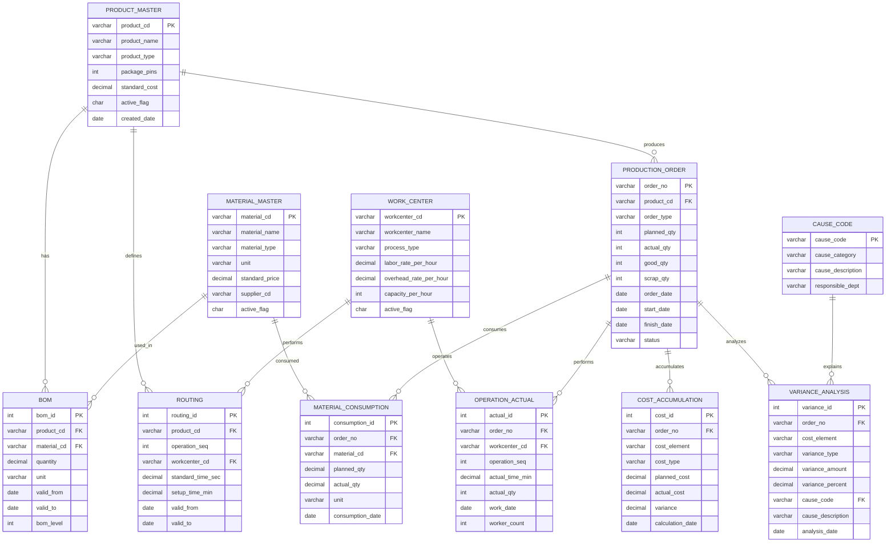
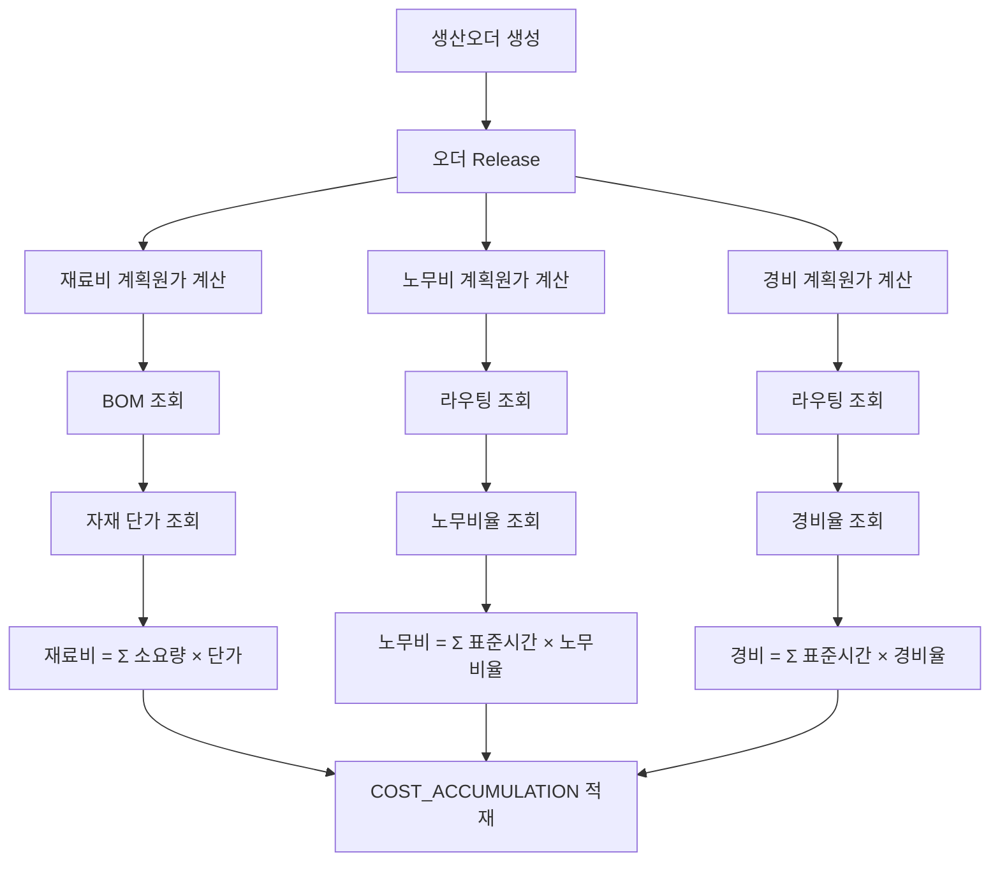
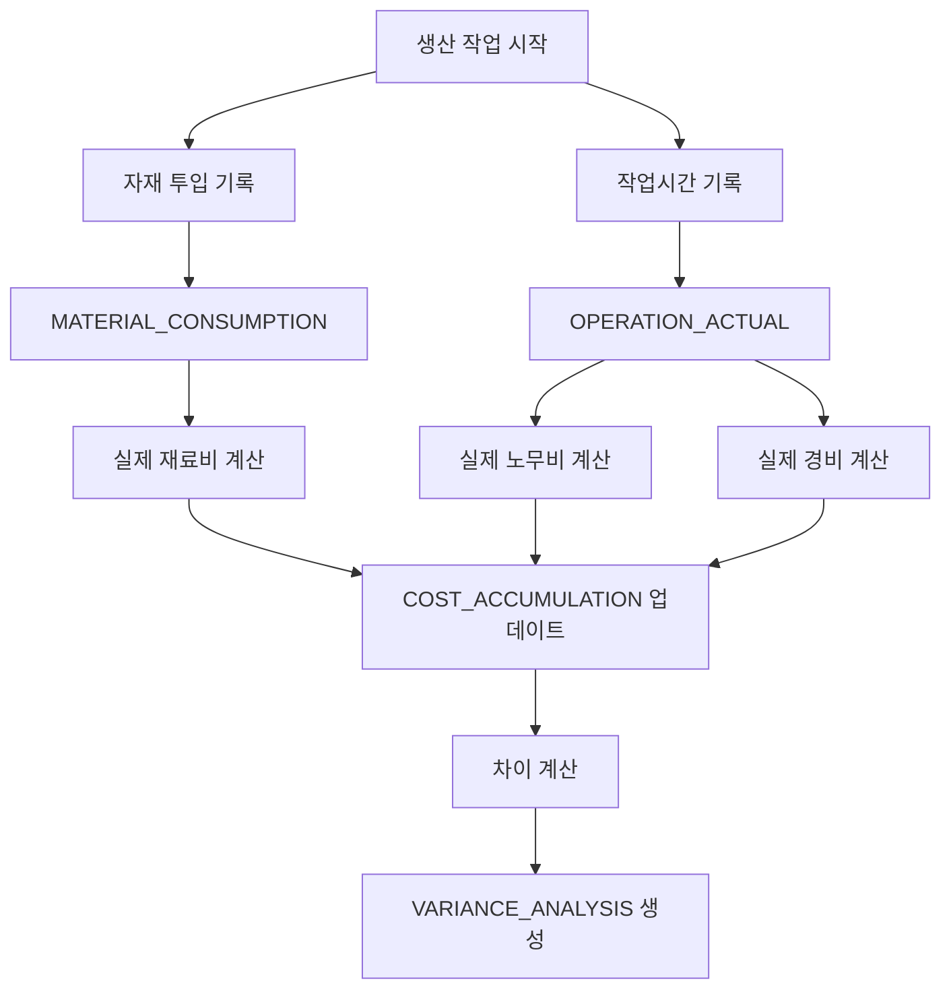
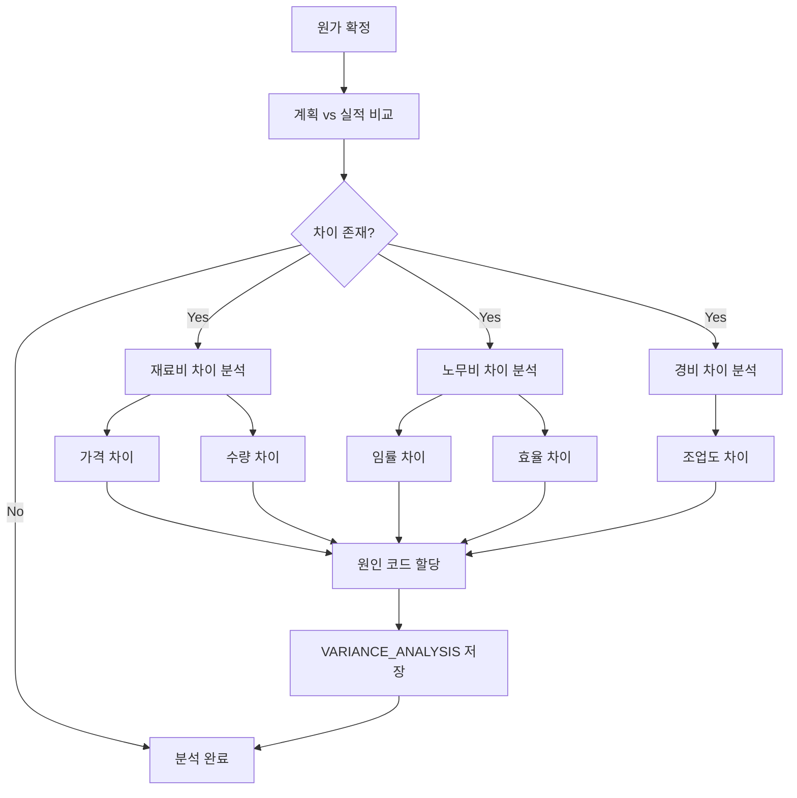

# RDB 시스템 설계 문서

## 개요

전통적인 관계형 데이터베이스(RDB) 기반의 반도체 패키징 원가관리 시스템입니다.
SAP의 CO-PC (Product Cost Planning) 모듈을 참조하여 설계되었습니다.

## ERD (Entity Relationship Diagram)



## 테이블 분류

### 1. 마스터 데이터 (Master Data)

#### 1.1 PRODUCT_MASTER (제품 마스터)
**목적**: 생산하는 반도체 패키지 제품의 기본 정보 관리

**주요 컬럼**:
- `product_cd`: 제품 코드 (예: QFP64-001)
- `product_type`: 패키지 타입 (QFP, BGA, SOP 등)
- `standard_cost`: 표준 원가

**비즈니스 규칙**:
- 제품 코드는 유일해야 함
- 표준 원가는 정기적으로 갱신됨 (통상 반기 1회)

#### 1.2 MATERIAL_MASTER (자재 마스터)
**목적**: 생산에 사용되는 모든 자재의 정보 관리

**주요 자재 분류**:
- DIE: 실리콘 칩
- SUBSTRATE: 기판/리드프레임
- WIRE: 금선
- RESIN: 에폭시 수지
- CHEMICAL: 접착제 등

**가격 관리**:
- `standard_price`: 표준 단가 (구매팀에서 관리)
- 실제 구매가격은 별도 테이블 필요 (단순화를 위해 생략)

#### 1.3 BOM (Bill of Materials)
**목적**: 제품별 자재 소요량 정의

**특징**:
- 유효기간 관리 (`valid_from`, `valid_to`)
- 제품 변경 이력 추적 가능
- BOM 레벨로 단계 구분 (직접 자재 = 1)

**예시**: QFP64-001 제품
- 다이 1개
- 리드프레임 1개
- 금선 10mg
- 에폭시 1g

#### 1.4 WORK_CENTER (작업장)
**목적**: 생산 공정별 작업장 정보 및 원가율 관리

**주요 작업장**:
- Die Bonding
- Wire Bonding
- Molding
- Marking
- Final Test

**원가율**:
- `labor_rate_per_hour`: 시간당 노무비 (직접 작업자 인건비)
- `overhead_rate_per_hour`: 시간당 제조경비 (장비 감가상각, 전력비 등)

#### 1.5 ROUTING (라우팅)
**목적**: 제품별 공정 순서 및 표준 작업시간 정의

**표준시간 관리**:
- `standard_time_sec`: 제품 1개당 표준 작업시간 (초)
- `setup_time_min`: 작업 준비 시간 (로트당)

### 2. 트랜잭션 데이터 (Transaction Data)

#### 2.1 PRODUCTION_ORDER (생산오더)
**목적**: 생산 지시 및 실적 관리

**생산 수량**:
- `planned_qty`: 계획 투입 수량
- `actual_qty`: 실제 투입 수량
- `good_qty`: 양품 수량
- `scrap_qty`: 불량 수량

**수율 계산**:
```
수율 = (good_qty / planned_qty) × 100
불량률 = (scrap_qty / planned_qty) × 100
```

**상태 관리**:
- CREATED: 오더 생성
- RELEASED: 작업 지시
- CONFIRMED: 실적 확정
- CLOSED: 원가 정산 완료

#### 2.2 MATERIAL_CONSUMPTION (자재 투입 실적)
**목적**: 생산오더별 실제 자재 사용량 기록

**계획 vs 실적**:
- `planned_qty`: BOM 기준 계획 소요량
- `actual_qty`: 실제 투입량

**차이 발생 원인**:
- 불량 발생으로 재투입
- 공정 로스
- 측정 오차

#### 2.3 OPERATION_ACTUAL (작업 실적)
**목적**: 공정별 실제 작업시간 및 수량 기록

**작업 시간**:
- 라우팅의 표준시간과 비교하여 효율성 측정
- 준비시간 + (단위시간 × 수량)

#### 2.4 COST_ACCUMULATION (원가 집계)
**목적**: 생산오더별 원가 요소별 계획/실적 집계

**원가 요소** (`cost_element`):
- MATERIAL: 재료비
- LABOR: 노무비
- OVERHEAD: 제조경비

**차이 계산**:
```
variance = actual_cost - planned_cost
```

**집계 시점**:
- 계획원가: 오더 RELEASED 시점
- 실적원가: 오더 CONFIRMED 시점

#### 2.5 VARIANCE_ANALYSIS (원가차이 분석)
**목적**: 차이의 유형별 상세 분석 및 원인 코드 관리

**차이 유형** (`variance_type`):
- **PRICE**: 가격 차이 (재료비)
  - 공식: (실제단가 - 표준단가) × 실제수량
- **QUANTITY**: 수량 차이 (재료비)
  - 공식: (실제수량 - 표준수량) × 표준단가
- **RATE**: 임률 차이 (노무비)
  - 공식: (실제임률 - 표준임률) × 실제시간
- **EFFICIENCY**: 효율 차이 (노무비)
  - 공식: (실제시간 - 표준시간) × 표준임률
- **YIELD**: 수율 차이
  - 공식: (투입수량 - 산출수량) × 단위원가
- **VOLUME**: 조업도 차이 (경비)
  - 공식: (실제생산량 - 정상생산량) × 고정비율

### 3. 참조 데이터 (Reference Data)

#### 3.1 CAUSE_CODE (원인 코드)
**목적**: 표준화된 차이 원인 관리

**주요 원인**:
- GOLD_PRICE_UP: 금 시세 상승
- SUPPLIER_ISSUE: 공급업체 품질 이슈
- OVERUSE: 자재 과다 사용
- NEW_WORKER: 신규 작업자 투입
- EQUIPMENT_OLD: 장비 노후화
- LOW_VOLUME: 조업도 저하
- YIELD_LOSS: 수율 저하

## 원가 계산 프로세스

### 1. 계획원가 계산 흐름



### 2. 실적원가 계산 흐름



### 3. 차이분석 흐름



## RDB의 장점

1. **데이터 무결성**: 
   - Foreign Key 제약으로 참조 무결성 보장
   - 트랜잭션 관리로 ACID 속성 보장

2. **표준화된 쿼리**:
   - SQL 표준 사용
   - 복잡한 집계 및 통계 처리

3. **성숙한 생태계**:
   - 다양한 관리 도구
   - 백업/복구 솔루션
   - 성능 튜닝 노하우

## RDB의 문제점 (원가차이 분석 관점)

### 1. 복잡한 JOIN

**문제**: 차이 원인 추적을 위해 5-6개 이상의 테이블 JOIN 필요

```sql
-- 재료비 차이 근본 원인 추적
SELECT ...
FROM VARIANCE_ANALYSIS v
JOIN PRODUCTION_ORDER po ON v.order_no = po.order_no
JOIN PRODUCT_MASTER pm ON po.product_cd = pm.product_cd
JOIN BOM b ON po.product_cd = b.product_cd
JOIN MATERIAL_MASTER mm ON b.material_cd = mm.material_cd
JOIN ROUTING r ON po.product_cd = r.product_cd
JOIN WORK_CENTER wc ON r.workcenter_cd = wc.workcenter_cd
-- 성능 저하 발생
```

### 2. 관계 표현의 한계

**문제**: 암묵적 관계를 표현하기 어려움

- 유사 제품 간의 관계
- 공통 원인의 전파 관계
- 시계열 패턴 관계

### 3. 그래프 탐색의 어려움

**문제**: 다단계 BOM이나 원인 추적을 위한 재귀 쿼리가 복잡하고 느림

```sql
-- 다단계 BOM 조회 (재귀 CTE 필요)
WITH RECURSIVE bom_tree AS (
  SELECT ... FROM BOM WHERE product_cd = 'XXX'
  UNION ALL
  SELECT ... FROM BOM b JOIN bom_tree bt ...
)
SELECT * FROM bom_tree;
```

### 4. 실시간 분석의 한계

**문제**: 
- 대량의 오더 데이터 축적 시 쿼리 성능 저하
- 인덱스 추가로 쓰기 성능 저하
- 파티셔닝 필요 (관리 복잡도 증가)

### 5. 유사 패턴 발견의 어려움

**문제**: 
- 자기 조인으로 인한 카티시안 곱
- 패턴 매칭 로직을 SQL로 표현하기 어려움

## 성능 최적화 전략 (RDB)

1. **인덱스 최적화**:
   - 조인 컬럼에 인덱스
   - 커버링 인덱스
   - 파티션 인덱스

2. **파티셔닝**:
   - 날짜별 파티셔닝 (월별/분기별)
   - 제품 타입별 파티셔닝

3. **뷰 및 구체화된 뷰**:
   - 자주 사용하는 집계를 뷰로 저장
   - 실시간성이 낮은 경우 구체화된 뷰 사용

4. **쿼리 최적화**:
   - Execution Plan 분석
   - 불필요한 JOIN 제거
   - 서브쿼리를 JOIN으로 변환

**한계**: 근본적인 구조적 문제는 해결 불가 → Neo4j 도입 필요

## 다음 단계

RDB의 한계를 극복하기 위해 Neo4j 그래프 데이터베이스를 도입하여:
- 복잡한 JOIN 없이 관계 탐색
- 암묵적 관계를 명시적으로 표현
- 빠른 패턴 매칭 및 경로 탐색
- 실시간 차이 원인 분석

을 구현합니다.
